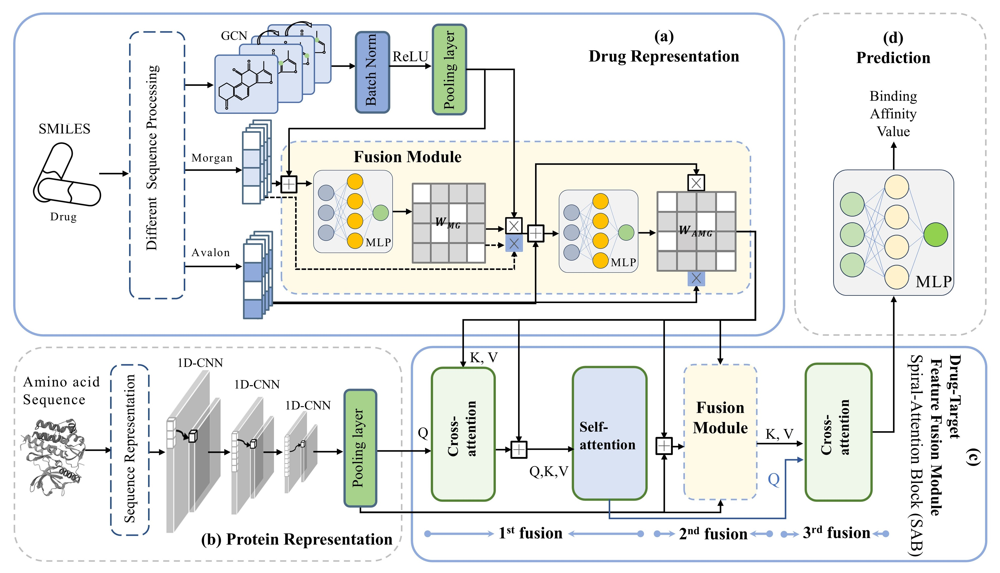

# MTAF-DTA

A Pytorch Implementation of paper:

**MTAF-DTA: Multi-type attention fusion network for drug-target affinity prediction**

 Jinghong Sun, Han Wang, Jia Mi, Jing Wan, and Jingyang Gao


The development of drug-target binding affinity (DTA) prediction tasks significantly drives the drug discovery process forward. Leveraging the rapid advancement of artificial intelligence (AI), DTA prediction tasks have undergone a transformative shift from wet lab experimentation to machine learning-based prediction. This transition enables a more expedient exploration of potential interactions between drugs and targets, leading to substantial savings in time and funding resources. However, existing methods still face several challenges, such as incomplete extraction of drug information, lack of calculation of the contribution of each modality, and lack of simulation regarding the drug-target binding mechanisms. In this paper, We propose MTAF-DTA, a method for drug-target binding affinity prediction to solve the above problems. The drug representation module extracts three modalities of features from drugs and uses an attention mechanism to update their respective contribution weights. Additionally, we design a Spiral-Attention Block (SAB) as drug-target feature fusion module based on multi-type attention mechanisms, facilitating a triple fusion process between them. The SAB, to some extent, simulates the interactions between drugs and targets, thereby enabling outstanding performance in the DTA task. The experimental results demonstrate the predictive capability of MTAF-DTA, with CI and MSE metrics showing respective improvements of 3$\%$ and 9.9$\%$ over the state-of-the-art (SOTA) method in the novel target settings. Furthermore, downstream tasks further validate MTAF-DTA's superiority in DTA prediction.

## 0. Overview of MTAF-DTA



Set up the environment:

In our experiment we use, Python 3.8.0 with PyTorch  2.0.1.

```
git clone https://github.com/shly-lab/MTAF-DTA.git
conda env create -f environment.yml
```

# 1. Dataset

The data should be in the format .csv: 'smiles', 'target_sequences', 'affinity'.

# 2. How to train

```
nohup python train.py 2>save_result/train&
```

# 3. To train YOUR model:

Your data should be in the format .csv, and the column names are: 'smiles', 'target_sequences', 'affinity'.

Generate the drug feature file from the given document using the [AMF.py](https://github.com/shly-lab/MTAF-DTA/blob/main/AMF.py)

Then you can freely tune the hyperparameter for your best performance.

